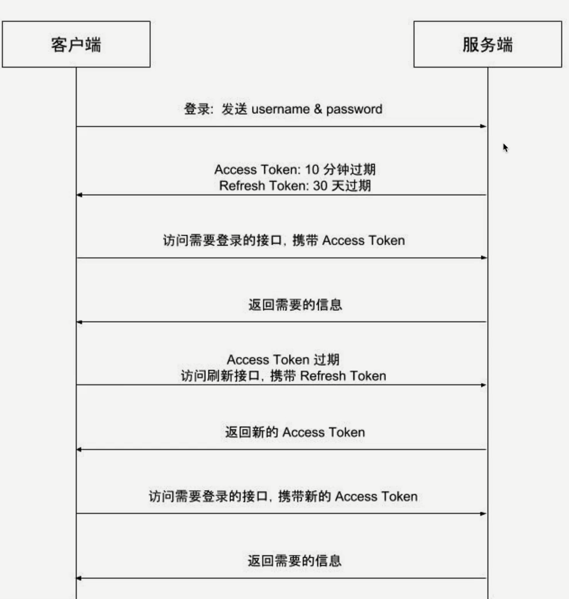
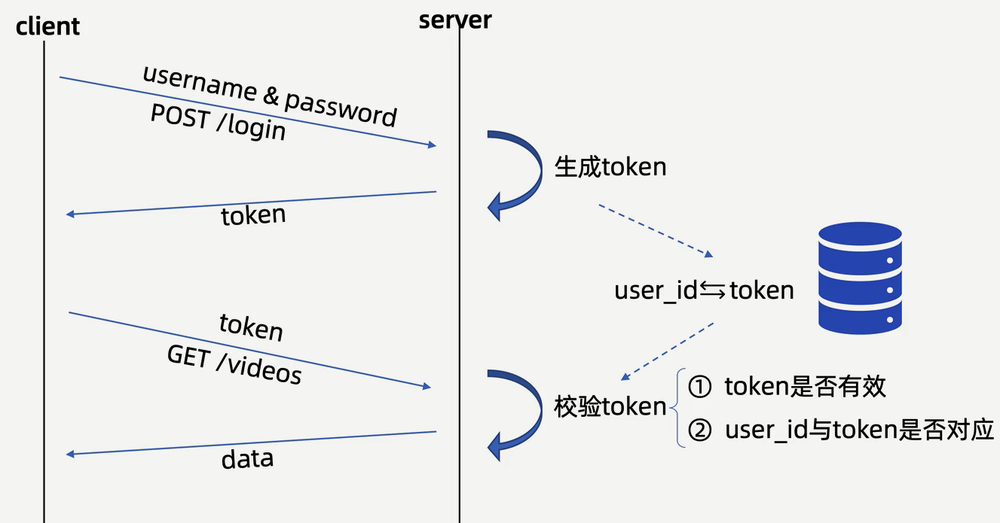

### 分布式ID生成器
- 特点：
  - 全局唯一性：不能出现有重复的ID表示，这是基本要求
  - 递增性：确保生成ID对于用户或业务是递增的
  - 高可用性：确保任何时候都能生成正确的ID
  - 高性能性：在高并发的环境下依然表现良好
- 典型场景：
  - 电商促销短时间内大量的订单涌入到系统
  - 微博热点时间
- 要求：
  - 期望带有一些时间信息
  - 便于分库分表之后，也能以时间顺序对这些消息进行排序
- snowflake/雪花算法
  - Twitter开源的64位整数祖晨分布式ID，性能较高，并且在单机上递增
  - 组成：第一位1bit，始终为0；时间戳41bit，工作机器id 10bit;序列号12bit：同毫秒内生成的不同ID
- Go实现的开源库
  - `github.com/bwmarrin/snowflake`
  - `github.com/sony/sonyflake`
- 业务分层
  - `Controller`：服务的入口，负责处理路由、参数校验、请求转发
  - `Logic/Service`：逻辑层（服务层），负责处理业务逻辑
  - `DAO/Repository`：负责数据与存储相关功能
- MVC即Model、View、Controller即模型、视图、控制器
  - View层是界面，Controller层是业务逻辑，Model层是数据库访问
  - MVC要实现的目标是将软件用户界面和业务逻辑分离以使代码可扩展性、可复用性、可维护性、灵活性加强

### 鉴权
- 用户认证
  - Cookie-Session认证模式
    - 流程：
      - 客户端使用用户名、密码进行认证
      - 服务端验证用户名、密码正确后生成并存储Session，将SessionID通过Cookie返回给客户端
      - 客户端访问需要认证的接口时在Cookie中携带SessionID
      - 服务端通过SessionID查找Session并进行鉴权，返回给客户端需要的数据
    - 存在的问题：
      - 服务端需要存储Session，并且由于Session需要经常快速查找，通常存储在内存或内存数据库中，同时在线用户较多时需要占用大量的服务器资源
      - 当需要扩展时，创建Session的服务器可能不是验证Session的服务器，所以还需要将所有Session单独存储并共享
      - 由于客户端使用Cookie存储SessionID，在跨域场景下需要进行兼容性处理，同时这种方式也难以防范CSRF攻击
  - Token认证模式
    > 无状态会话管理方式，服务端不再存储信息
    - 流程
      - 客户端使用用户名、密码进行认证
      - 服务端验证用户名、密码正确后生成Token返回给客户端
      - 客户端保存Token，访问需要认证的接口时在URL参数或HTTP Header中加入Token
      - 客户端通过解码Token进行鉴权，返回给客户端需要的数据
    - 优点（对比Cookie-Session）
      - 服务端不需要存储和用户鉴权有关的信息，鉴权信息会被加密到Token中，服务端只需要读取Token中包含的鉴权信息即可
      - 避免了共享Session导致的不易扩展问题
      - 不需要依赖Cookie，有效避免Cookie带来的CSRF攻击问题
      - 使用CORS实现跨域
- JWT
  - JSON Web Token
  - 适用于分布式站点的单点登录
  - 默认不加密，不能把秘密信息放在这个部分
  - `头部.负载.签名`
    - Header是一个JSON对象，其中存储了所使用的加密算法和Token类型
    - Payload表示负载，是一个JSON对象，JWT规定了7个官方字段供选用，开发者也可以自己指定字段和内容
    - Signature是对前两部分的签名，防止数据篡改
  - 优缺点
    - 拥有基于Token的会话管理方式所拥有的一切优势，不依赖Cookie，使得其可以防止CSRF攻击，也能在禁用Cookie的浏览器环境中正常运行
    - 最大优势是服务端不再需要存储Session，是的服务端认证鉴权业务可以方便扩展，表面存储Session所需要引入的Redis等组件，降低了系统架构复杂度。
    - 同时是最大劣势，有效期存储在Token中，一旦签发，就会在有效期内一直可用，无法在服务端废止，可用户进行登出操作，只能依赖客户端删除掉本地存储的JWT Token，如果需要禁用用户，单纯使用JWT就无法做到了
  - 
  - 限制一个设备同一时间只能登录一个设备
  - 
- 前后端交互数字失真问题
  - 由于Js和Go整数表示的范围不同，因此需要进行处理
  - 处理策略是转化成`string`
  - 可以来回转换，但是不够好
  - 在结构体上加json_tag时，加上一个`,string`